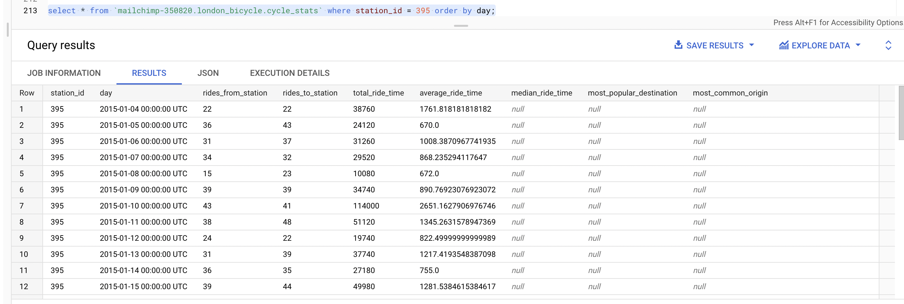

### Julia Flanagan
### BigQuery table 'cycle_stats'



### Steps I followed
1. I copied the public data into cycle_stations and cycle_hire
2. I loaded the JSON data into staging tables: cycle_stations_update and cycle_hire_update
3. From there, I explored the data in the update tables. I found that 3 rows in cycle_stations weren't in the update, and I chose to keep them when I did the merge.
4. I created new tables that merged the updated and original tables: cycle_stations_merged and cycle_hire_merged

```sql
CREATE TABLE `mailchimp-350820.london_bicycle.cycle_stations_merged` AS (
  SELECT * FROM `mailchimp-350820.london_bicycle.cycle_stations_update`
  UNION ALL 
  (SELECT * FROM `mailchimp-350820.london_bicycle.cycle_stations` o WHERE o.id NOT IN (SELECT id FROM `mailchimp-350820.london_bicycle.cycle_stations_update`))
);

CREATE TABLE `mailchimp-350820.london_bicycle.cycle_hire_merged` AS (
  SELECT * FROM `mailchimp-350820.london_bicycle.cycle_hire_update`
  UNION ALL 
  (SELECT * FROM `mailchimp-350820.london_bicycle.cycle_hire` o WHERE o.rental_id NOT IN (SELECT rental_id FROM `mailchimp-350820.london_bicycle.cycle_hire_update`))
);
```

4. For the stats table, I started with one station to see if I could get all the data. I decided not to correctly handle rides that started on one day and ended on another day, in the interest of time.

```sql
insert into `mailchimp-350820.london_bicycle.cycle_stats`
select start.station_id, timestamp(start.day), start.rides_from_station, endd.rides_to_station, start.total_ride_time, average_ride_time, null, null, null
from (
  select stations.id as station_id, date(start.start_date) as day, count(start.rental_id) as rides_from_station, sum(start.duration) as total_ride_time, avg(start.duration) as average_ride_time
  from `mailchimp-350820.london_bicycle.cycle_stations_merged` stations
  join `mailchimp-350820.london_bicycle.cycle_hire_merged` start on start.start_station_id = stations.id
  group by station_id, day
) start
join (
  select stations.id as station_id, date(endd.start_date) as day, count(endd.rental_id) as rides_to_station
  from `mailchimp-350820.london_bicycle.cycle_stations_merged` stations
  join `mailchimp-350820.london_bicycle.cycle_hire_merged` endd on endd.end_station_id = stations.id
  group by station_id, day
) endd on start.day = endd.day and start.station_id = endd.station_id
order by start.day;
```


### Why I chose Option 1:
1. It seems closely related to the ongoing work that Kale described in our call
2. I'm not familiar with Google BigQuery and this seemed like a great opportunity to learn it
3. I enjoy writing SQL queries


### Gotcha's that I encountered
- I needed to select EU for region, which wasn't the default
- cycle_hire.id is NULLABLE and not required, which isn't great for a primary key
- cycle_hire.locked is a string of "true" or "false" instead of a boolean